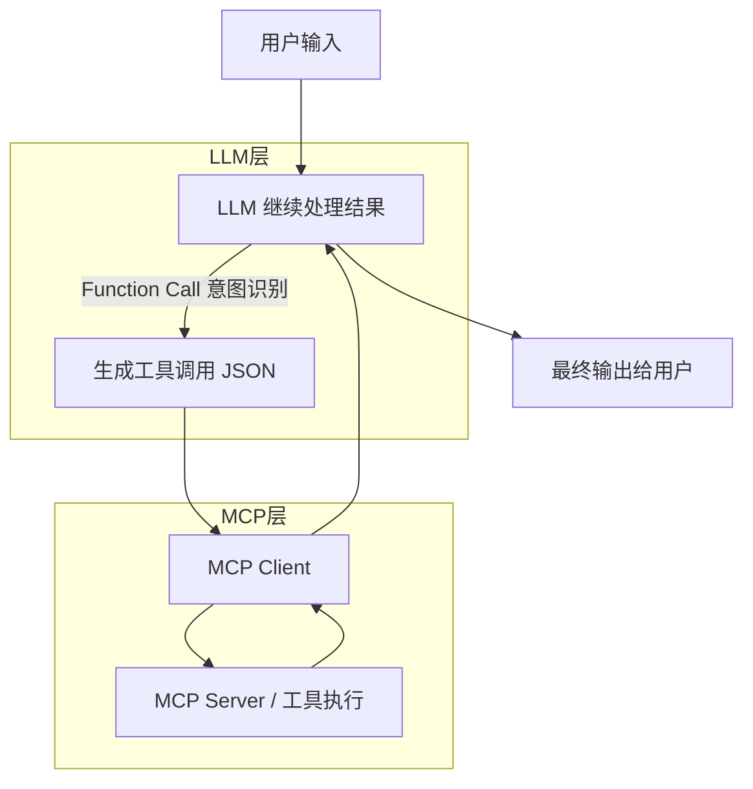

MCP在agent中是个并不陌生的词语，本文将从定义，作用，代码等多个角度尽量详细讲述它最为完整的用法。

## MCP是什么？

**MCP (Model Context Protocol)** 是由 Anthropic 公司推出的一个**开放标准**，旨在解决 **AI 模型与外部数据源、工具（如本地文件、数据库、API）**之间的连接难题。它相当于为 AI 打造了一个“通用接口”，让开发者只需编写一次连接器，就能让不同的 AI 客户端（如 Claude、IDE 或其他助手）无缝、安全地访问各类实时数据和功能。

MCP可以理解成 在AI领域发明了USB接口，让模型和工具之间实现了标准化。MCP本质上是模型调用数据，那么它跟tool，function call有什么区别呢？

### MCP VS function call VS tool

- tool泛指模型可以调用的外部能力。
- function calling 是一种模型和外部函数通信的结构化接口标准。调用过程中，模型会输出json格式告诉系统需要用到的函数工具，之后再由系统调用函数获得结果，然后给模型生成最终回复。
- MCP 是一个”模型-工具生态“的标准化协议。
  - 初始化：client启动server进程，询问server所支持的tools，资源文件等
  - 运行：当我们调用LLM时，LLM用来确定使用哪些MCP server，MCP server执行对应的函数得到执行结果返回给client

| **维度**     | **Function Calling (传统方式)**                              | **MCP (新一代标准)**                                         |
| ------------ | ------------------------------------------------------------ | ------------------------------------------------------------ |
| **本质**     | **模型输出能力**：模型根据你的指令生成一段 JSON，告诉你该调用哪个函数。 | **通用连接协议**：一套连接模型、客户端与数据源的标准框架。   |
| **耦合度**   | **紧耦合**：你需要为每个模型（OpenAI, Anthropic 等）写特定的 API 代码和 Schema。 | **解耦/插拔**：写一次 MCP Server，任何支持 MCP 的客户端（Claude, Cursor 等）都能直接用。 |
| **执行位置** | **开发者端**：你需要自己写逻辑去解析 JSON 并运行函数。       | **客户端/Server 端**：逻辑封装在 MCP Server 中，客户端只需“插上”即可自动运行。 |
| **交互模式** | **单次请求-响应**：模型给指令，你执行，给结果。              | **持续会话/动态发现**：支持资源订阅、实时更新和多工具链式调用。 |
| **安全性**   | **应用级控制**：安全性全靠你自己在代码里怎么写。             | **协议级隔离**：通过标准化的权限管理和本地进程隔离，更安全地访问私有数据。 |


## MCP的通信模式

在 Model Context Protocol (MCP) 的标准规范中，通信主要基于 **JSON-RPC 2.0** 协议，而其底层实现（Transport 层）主要通过三种常见的模式（或传输方式）来完成。

1.标准输入输出模式

MCP 宿主程序（如 Claude Desktop 或 IDE）直接启动 MCP 服务器作为一个子进程。双方通过操作系统的标准输入 (`stdin`) 和标准输出 (`stdout`) 流来交换 JSON-RPC 消息。

**适用场景**：本地文件系统操作、本地脚本运行、开发者在自己机器上调试工具。

2.HTTP+SSE 模式 (Server-Sent Events)

利用sse建立一个持久的单向连接，服务器可以随时向客户端推送消息

客户端通过标准的http请求发送消息到服务器

**适用场景**：连接云端数据库、调用 SaaS 服务的 API、远程 AI Agent 的协作。

3.可流式传输的 HTTP 模式 (Streamable HTTP)

相比sse，处理大量并发请求时更高效

**适用场景**：需要返回大量实时数据流（如实时日志、长文本生成）的复杂场景。


## MCP的运行逻辑

- MCP client：负责启动并连接 Server，将用户的指令转发给 Server，并将 Server 返回的数据喂给 AI 大模型。

- MCP Server：负责连接具体的工具（如数据库、API、本地文件）
  - 可以在本地用`@mcp.tool`快速定义工具，也可以直接采用其它外部工具的mcp server。使用本地工具时，在握手阶段，server会自动将装饰器`@mcp.tool`转换成由name，description，inputSchema的json结构返回；随后在决策阶段，mcp收到来自client的问题时，LLM识别出意图，能够回复client调用哪些函数，随后client将该结果发送给server端执行，server执行后将结果返回给client。
  - 上段中的LLM识别意图 是在我们直接用大模型配置MCP的过程中主动执行的，那么在实际写代码的时候，这部分是如何实现的？

| **步骤**    | **参与方**                      | **核心动作**                              |
| ----------- | ------------------------------- | ----------------------------------------- |
| **1. 发现** | Client $\leftrightarrow$ Server | 确认有哪些工具可以用（握手）              |
| **2. 决策** | LLM                             | 决定用哪个工具，生成调用参数              |
| **3. 执行** | MCP Server                      | **在本地/私有环境**执行代码，获取真实数据 |
| **4. 完成** | Client $\rightarrow$ LLM        | 将真实数据喂回模型，生成最终回复          |


## 代码实践

### function call调用流程

```python
from langchain_core.tools import tool
from langchain_openai import ChatOpenAI

llm = ChatOpenAI(
    model="deepseek-chat",
    api_key="sk-xxxxx",
    base_url="https://api.deepseek.com"
)

@tool(description="查询天气信息")
def query_weather(city_name: str) -> str:
    return f"{city_name}今天晴朗，气温 25 度，适合户外活动"

llm_with_tools = llm.bind_tools([query_weather])

user_question = "北京今天天气怎么样？"
messages = [{"role": "user", "content": user_question}]
response = llm_with_tools.invoke(messages)
print(response.tool_calls)

# 执行工具调用
if response.tool_calls:
    tool_result = query_weather.invoke(response.tool_calls[0])
    messages.append(response)
    messages.append(tool_result)

    final_response = llm_with_tools.invoke(messages)
    print(final_response.content)
```


### 独立的MCP示例

MCP Server

```python
from mcp.server import Server
from mcp.types import TextContent

server = Server(name="demo-mcp-server")

@server.tool(
    name="analyze_text",
    description="Analyze text and detect whether it contains errors"
)
async def analyze_text(text: str) -> str:
    if "error" in text.lower():
        result = "❌ Detected error in text"
    else:
        result = "✅ Text looks normal"

    # 保存到服务器状态
    server.state["last_result"] = result
    return result

@server.resource("memory://last_result")
async def last_result():
    return TextContent(
        type="text",
        text=server.state.get("last_result", "No result yet")
    )

# 4️⃣ 运行 MCP Server
if __name__ == "__main__":
    server.run_stdio()
```

MCP client

```python
from mcp.client import Client

client = Client(
    command="python",
    args=["mcp_server.py"]
)

text_to_check = "There is an error in the system"

result = client.call_tool(
    tool_name="analyze_text",
    arguments={"text": text_to_check}
)

last_result = client.read_resource("memory://last_result")
print("Last result from resource:", last_result.text)
```


### langchain和MCP

我们知道在MCP具体执行相应的server之前存在意图识别的过程，由于langchain的封装，意图识别的步骤不再需要人为完成，具体体现在当把tools绑定到agent时，langchain讲tools的schema注入agent prompt，再之后LLM看到user prompt时，能够自己判断需要的工具和对应的参数，然后由MCP server端执行。

具体步骤如下：

1 启动MCP server独立进程

```shell
npx @modelcontextprotocol/server-filesystem ./data
python mcp_server.py # 本地
```

2 初始化MCPClient

```python
from langchain_mcp import MCPClient
mcp = MCPClient(
    command="python",
    args=["mcp_server.py"],  # MCP Server 启动方式
)
tools = mcp.get_tools() # 获取MCP tools，拉取tool原信息（tool/description/args schema），转换成langchain的StructuredTool
```

3 agent调用

```python
agent = create_react_agent(
    llm=llm,
    tools=tools,
    prompt=prompt
) # 修改prompt进行意图识别

result = agent.invoke({
    "input": "帮我分析这段文本：There is an error in the system"
})

print(result)
```


## MCP局限

核心：关于tools的定义描述在prompt中会占用模型大量token。

对于该问题，Anthropic推出Agent Skills系统，这是一套动态加载的指令和脚本集合，采用渐进式披露，它可以教会AI如何完成特定任务。


## 综合

MCP 的出现是为了让 Function Call 变得**更通用、更易于扩展**，MCP 可以看作工具池，Function Call 是决策机制。

- **Function Call** 解决了 **“模型如何告诉我们它想干什么”** 的格式问题。

  function call是经过意图识别返回这个llm所需要用到的外部工具，返回json进行调用；MCP则是执行外部工具返回结果的过程。

- **MCP** 解决了 **“我们如何以统一的标准把各种工具和数据喂给模型”** 的架构问题。

  - 在MCP server中，可以接收来自外界的工具 比如tavily搜索工具，google地图等，也可以接收本地工具，只要采用了mcp封装，服务端只要收到了需要运行的name和input schema，就能自动运行得到相应的结果。
  - 在mcp client发送相应信息给server之前，需要llm进行意图识别，在langchain的create react agent中已经封装了相应的逻辑就无需手动识别，如果是自己写的agent注意进行意图识别然后调用相关的工具。




## 八股参考

### 1 MCP的核心组件

- **MCP 服务器 (Server)**：数据的提供方。它负责连接具体的资源（如数据库、本地文件、API），并将其标准化。
- **MCP 客户端 (Client)**：数据的消费者。通常是集成了 AI 的应用（如 Claude Desktop、IDE），负责发起请求。
- **本地/远程主机 (Host)**：实际运行客户端并维持生命周期的环境。

### 2 MCP服务端提供哪些类型的资源

MCP 服务端提供的资源主要包括四类：**工具执行结果**（如上一次分析或计算的结果）、**全局或内部状态**（如 server.state、计数器、缓存）、**静态数据**（如配置文件、系统信息）以及**动态计算资源**（如实时时间或对状态数据的统计），本质上就是一组可被客户端查询的只读数据接口。

MCP包括的数据：Tool = 执行动作 + 可修改状态；Resource = 查询数据 + 返回结果

- **Resources (资源)**：**只读**的数据。比如读取一个本地文件内容、查看数据库表结构或获取日志。
- **Tools (工具)**：**可执行**的操作。比如发送一封邮件、运行一段 Python 代码或修改某个系统设置。

### 3 MCP支持哪些通信方式和协议

MCP 建立在 JSON-RPC 2.0 基础之上，目前主要支持两种传输层协议：

- **stdio (标准输入输出)**：最常用的本地连接方式，客户端通过子进程直接启动 Server 并通过管道通信。
- **SSE (Server-Sent Events)**：用于远程连接，基于 HTTP 协议实现服务器到客户端的流式传输。
- 可流式传输的 HTTP 模式 (Streamable HTTP)

### 4 MCP中的工具是什么，如何调用

工具是服务端注册的可执行模块，可以理解为 Server 提供的“能力单元”。

**调用过程**：

1. **暴露**：Server 告诉 Client ：“我有 `read_file` 这个工具”。
2. **决策**：LLM 通过 **Function Calling** 决定使用该工具并生成参数。
3. **请求**：Client 向 Server 发送 `tools/call` 请求。
4. **执行**：Server 运行代码并把结果传回给 Client，最终喂给 LLM

### 5 MCP客户端需要做什么

MCP 客户端的作用是负责发起工具调用和资源访问请求、管理通信协议，并获取 Server 执行结果，本身不执行工具逻辑，所有实际操作都在 MCP Server 端完成。

- **生命周期管理**：负责启动、连接和关闭 MCP Server。
- **权限管控**：在工具真正执行前，向用户询问是否允许执行（安全关卡）。
- **上下文聚合**：将 Server 返回的资源或工具结果转换为 LLM 能理解的消息格式（Prompt），并发送给大模型。


## 参考链接：

1 [MCP (Model Context Protocol)，一篇就够了。 - 知乎](https://zhuanlan.zhihu.com/p/29001189476)

2 [Introducing the Model Context Protocol](https://www.anthropic.com/news/model-context-protocol)

3 [MCP market](https://mcpmarket.cn/)

4 [langgraph And MCP](https://learngraph.online/LearnGraph%201.X/module-11-subgraph-mermaid-mcp-agent-node-tool/11.3%20LangGraph%20MCP%20Integration.html)